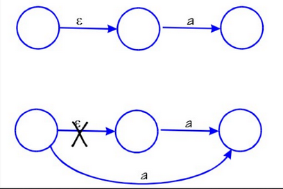
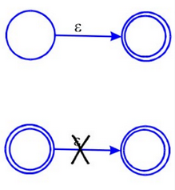

# Trabalho de implementação 1

- Alunos: Davi Figueiredo e [Davi Coutinho](https://github.com/Davi394)

## Tema

Converter um autômato finito não-determinístico (AFND) com epsilon-transições para um AFND sem epsilon-transições.

## Solução

%20-%20Michael%20Sipser.png>)

- Ref: Introdução à Teoria da Computação, 3 ed. (Pág. 57) - Michael Sipser.

### Passos

1. Se 'a' ∈ Σ, δ(q₁, ε) = q₂ e δ(q₂, 'a') = q₃ , acrescentaremos uma transição de q₁ para q₃ com 'a';



2. Se δ(q₁, ε) = q₂ e q₂ ∈ F, acrescentamos q₁ a F.



### Representação do autômato

Automato: 5-tupla (Q: conjunto finito de estados, Σ: Alfabeto, δ: função de transição, q₀: estado inicial, F: conjunto de estados finais)

```json
{
  "Automato-1": {
    "estados": [1, 2, 3],
    "alfabeto": ["a", "b", "ε"],
    "inicial": 1,
    "finais": [2],
    "transicoes": [
      [1, "ε", 2],
      [1, "a", 2],
      [2, "a", 3],
      [3, "b", 2]
    ]
  }
}
```

## Requisitos

Para executar o código é necessário ter:

- **Python 3.9+** ([Download](https://www.python.org/downloads/))
- **pytest** (para rodar os testes automatizados)

### Como rodar os testes (pytest)

1. Crie um ambiente virtual (recomendado)

```bash
python -m venv .venv
```

2. Ative o ambiente virtual

**Windows:**

```bash
.venv\Scripts\activate
```

**Linux/macOS:**

```bash
source .venv/bin/activate
```

3. Instale o pytest dentro do ambiente

```bash
pip install -r requirements.txt
```

4. Executar os testes (arquivo `testes.py`)

```bash
pytest testes.py
```

## Execução

1. Clone o repositório e vá para pasta `lftc/trab1`

```bash
git clone https://github.com/figdavi/lftc.git
cd lftc/trab1
```

2. Altere os autômatos no arquivo `automatos.json`

3. Rode o programa

```bash
python main.py
```

- Use `python3 main.py` se `python main.py` não funcionar

4. O resultado será impresso no cmd/terminal e escrito em `automato_sem_e.json`
